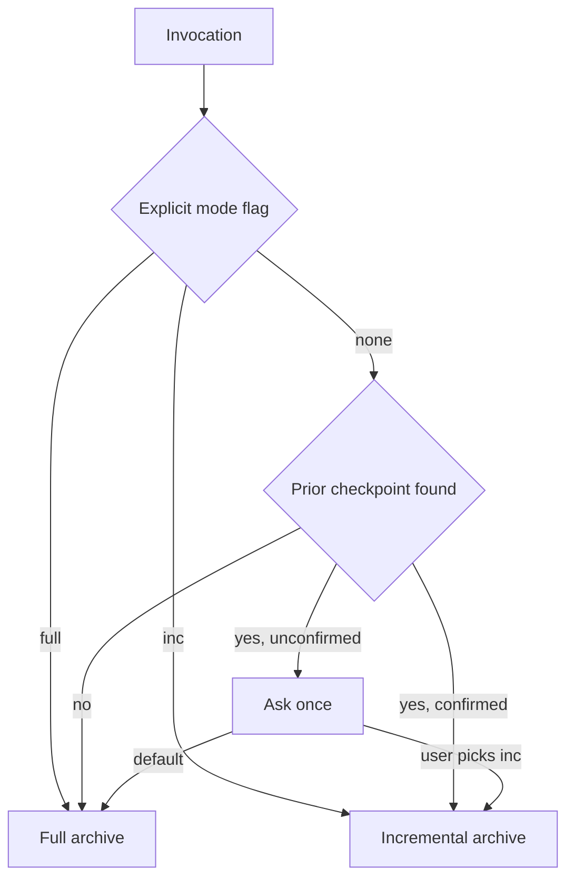
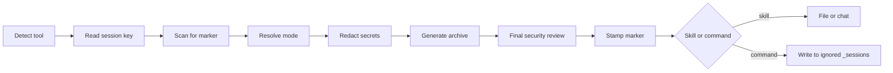

```
+----------------------------------------------------------+
|                                                          |
|   s e s s i o n - d e t a i l                     v2.0   |
|                                                          |
|   [ full ]--[ inc 02 ]--[ inc 03 ]--> next session       |
|                                                          |
|   Records the session. Redacts secret values.            |
|                                                          |
+----------------------------------------------------------+
```

<p align="center">
  
  
  
  
  
  
</p>

Session summaries compress, and compression is the problem: they discard the exact wording of decisions, the prompts you drafted but never ran, and the small technical notes that turn out to matter three days later, so you spend the start of every new session re-explaining what you already settled. `session-detail` records the session instead. It emits a detailed archive (`<session_full>`) plus a compact handoff block (`<context_updates>`) that you paste into your next session to resume with your locked decisions, open questions, and known gotchas intact. Safe content is preserved in full; credentials and other secret values are replaced with typed redaction placeholders.

---

## What it does

Every run produces exactly two blocks:

| Block | Role | Contents |
|---|---|---|
| `<session_full>` | The archive | Accomplishments, decisions with rationale and alternatives, issues with root causes, prompts executed, prompts drafted but unrun (captured in full after sensitive-value redaction), code changes, technical notes, next-session priorities |
| `<context_updates>` | The handoff | New facts, corrected facts, locked decisions, open questions, carry-forward warnings. This is the part you paste into your next conversation |

### Full and incremental modes

This is the core mechanic. On invocation, the skill auto-detects whether a checkpoint already exists for the current session. If one does, it produces an **incremental** covering only work since that checkpoint. If none does, it produces a **full** archive. You never have to track this yourself.



If a prior checkpoint exists but same-session cannot be confirmed, it asks exactly one question and defaults to full.

### Real invocations

Auto-detect (the normal case):

```
session detail
detailed session summary
session archive
```

Force a full archive even if a checkpoint exists:

```
full session detail
session-detail full
```

Force an incremental:

```
session detail incremental
session-detail inc
```

On Claude Code, the slash command takes the same modes as an argument:

```
/session-detail
/session-detail full
/session-detail inc
```

---

## Demo

Below is a fabricated example showing what the skill returns. The imaginary session was a two-hour block building a tenant-screening dashboard. This is illustrative only; your real output is populated from your actual conversation.

Here the run is the second checkpoint of a Claude Code session, so the skill detected the earlier checkpoint and produced an incremental. Output truncated for the README:

```markdown
<!-- session-detail | tool=code | session=a3f9c12b-77e2-4c1d-9b0a-5f6e8d21c4ab | seq=2 | generated=2026-07-13-11-42 -->

<session_full>

# Session code-2026-07-13-09-05-a3f9c12b-inc-02
Date: 2026-07-13
Suggested filename: code-2026-07-13-09-05-a3f9c12b-inc-02.md
Incremental continuation of code-2026-07-13-09-05-a3f9c12b.md. Covers only work after that checkpoint.

## Accomplished
- Replaced the mock JSON source in ScreeningTable.jsx with a live fetch against the screening API, keeping the existing column structure and click-to-sort behavior untouched.
- Added a skeleton-row loading state and an error state with a retry button.
- Mapped the API status values onto the existing StatusPill statuses; two legacy values did not map cleanly and currently fall back to Pending with a console warning.

## Decisions Made
- Decision: Keep sorting client-side for now.
  - Rationale: Production datasets are under 200 rows; a server-side sort endpoint adds surface area for no measurable gain at this size.
  - Alternatives considered: A sort parameter on the screening API, deferred until row counts justify it.
  - Impact: No API change needed. Revisit if datasets grow past roughly 200 rows.
- Decision: Unmapped API status values fall back to Pending, never to a new ad hoc status.
  - Rationale: An invented status would bypass statusColors.js and render an unstyled pill.
  - Alternatives considered: Throwing on unknown statuses, rejected as too brittle for legacy data.
  - Impact: Legacy "in_review" applicants display as Pending until product decides the mapping.

...

</session_full>

<context_updates>

## Context Updates for Next Session

### Decisions Locked
- Sorting stays client-side until real datasets exceed roughly 200 rows.
- Unknown API status values fall back to Pending; no ad hoc statuses are ever invented.

### Carry-Forward Warnings
- The screening API returns "in_review" for some legacy applicants. It currently maps to Pending and needs a product decision before launch.
- Do not add a new status without updating statusColors.js first, or the pill silently renders gray.

</context_updates>
```

---

## How it works



Detection rests on a hidden marker stamped on line one of every checkpoint:

```
<!-- session-detail | tool=code | session=<key> | seq=2 | generated=2026-06-20-11-30 -->
```

On Claude Code the session key is `$CLAUDE_SESSION_ID` (the date is a fallback only). On Claude.ai and Cowork, where there is no session ID to read, the skill scans the conversation context for a prior marker instead. The incremental boundary is positional: a new incremental covers only content after the previous checkpoint's position, not a wall-clock cutoff. The `generated` field is metadata for humans, not the boundary mechanism.

### Two forms, one archive

| | Skill (`SKILL.md`) | Command (`claude-code/session-detail.md`) |
|---|---|---|
| Installs to | `.claude/skills/session-detail/` | `~/.claude/commands/session-detail.md` |
| Invoked by | Natural-language phrases | The `/session-detail` slash command |
| Output | Downloadable file on Claude.ai/Cowork (chat is the fallback); chat on Claude Code | Written to `_sessions/` after local Git-exclusion verification, never printed to chat by default |
| Chat output | Both blocks | One-line confirmation plus a `Display output in chat? (y/N):` prompt |
| Works on | Claude.ai, Cowork, and Claude Code | Claude Code only |

### File naming

Files are tool-prefixed so their origin is obvious, and carry a session-ID fragment (`sid8`, the first 8 alphanumeric characters of the session key) so files from the same session pair by inspection:

- `code-YYYY-MM-DD-HH-MM-<sid8>.md` for a full archive
- `code-YYYY-MM-DD-HH-MM-<sid8>-inc-NN.md` for an incremental (`NN` equals the marker `seq` and starts at 02)
- `claude-` and `cowork-` prefixes name the file the skill produces on Claude.ai and Cowork (or the suggested filename when output goes to chat); those tools never write into a repo's `_sessions/`

The marker's full `session=` key remains the ground truth for matching; `sid8` is the human-readable hint.

---

## Security

Session archives are persistent artifacts. Sensitive-value protection therefore takes precedence over exact preservation.

Before producing an archive, the skill and command must redact passwords, API keys, tokens, cookies, authorization headers, private keys, OAuth client secrets, secret-bearing connection strings, cloud credentials, and other values identified as secret or sensitive. Variable names and surrounding structure can remain, but the value is replaced with a typed placeholder such as:

```text
OPENAI_API_KEY=[REDACTED: API KEY]
Authorization: Bearer [REDACTED: TOKEN]
[REDACTED: PRIVATE KEY]
```

The skill and command must not inspect `.env*`, credential stores, SSH private keys, cloud credential files, secret-manager exports, or similar sources solely to copy them into an archive. The Claude Code command performs a second sensitive-data review before writing.

When the slash command runs inside a Git worktree, it adds `_sessions/` to the repository's local Git exclude file and verifies that the directory is ignored before writing. This avoids changing the project's tracked `.gitignore` while reducing the chance of an archive being committed accidentally. The `session-detail` repository also ignores its own `_sessions/` directory.

If a redaction occurs, the archive includes this notice under `## Technical Notes`:

```text
- Security: Sensitive values were redacted from this archive.
```

Redaction reduces accidental persistence risk, but it is not a reason to paste secrets into an AI conversation. Keep active credentials out of prompts and rotate any credential that was exposed before these protections were applied.

---

## Install

### Claude Code: the skill (clone)

The repo name matches the skill name, so cloning produces the correct folder automatically.

**Project-level** (available in this project only). macOS/Linux:
```bash
cd .claude/skills/
git clone https://github.com/thebpandey/session-detail.git
```

Windows PowerShell:
```powershell
cd .claude\skills\
git clone https://github.com/thebpandey/session-detail.git
```

**User-level** (available across all your projects). macOS/Linux:
```bash
cd ~/.claude/skills/
git clone https://github.com/thebpandey/session-detail.git
```

Windows PowerShell:
```powershell
cd $env:USERPROFILE\.claude\skills\
git clone https://github.com/thebpandey/session-detail.git
```

Either way the result is:
```
.claude/skills/session-detail/SKILL.md
```

Recent versions of Claude Code pick up new skills in `.claude/skills` without a restart. If the skill does not trigger, restart the session.

### Claude Code: the slash command (optional)

Copies the command into your user-level commands directory so `/session-detail` works in every project. macOS/Linux:
```bash
cp claude-code/session-detail.md ~/.claude/commands/session-detail.md
```

Windows PowerShell:
```powershell
Copy-Item claude-code\session-detail.md $env:USERPROFILE\.claude\commands\session-detail.md
```

### Claude.ai (zip upload)

1. Download this repo as a ZIP (the green **Code** button, then **Download ZIP**), or zip the folder so that `SKILL.md` sits inside a folder named `session-detail`.
2. In Claude.ai, open **Settings** and find the custom Skills upload area, then upload the ZIP.
3. Custom skill upload requires a Pro, Max, Team, or Enterprise plan with code execution enabled.

Note: the exact Settings menu label for skill upload has shifted between releases. If you do not see it, check both the Capabilities and Features areas of Settings.

---

## Usage

- **End of a work block:** say `session detail`. First run of the session produces a full archive; later runs in the same session produce incrementals automatically.
- **Next session:** paste the `<context_updates>` block from your last checkpoint into the new conversation. Claude picks up your locked decisions, open questions, and warnings without re-explanation.
- **On Claude Code with the command installed:** run `/session-detail`. It verifies that `_sessions/` is locally ignored, writes `_sessions/code-<YYYY-MM-DD-HH-MM>-<sid8>.md` in the current repo, prints a one-line confirmation, and asks `Display output in chat? (y/N):` (defaulting to N), so a 15-20KB archive never sits in your context.
- **Override the mode** any time with `full` or `inc` as shown in [Real invocations](#real-invocations).

No placeholders leak into output: fields that cannot be filled from the conversation are omitted or marked `N/A`. Prompts you drafted but never ran are captured in full, including code blocks and constraints, after sensitive values are replaced with typed redaction placeholders.

---

## File structure

```
session-detail/
|-- SKILL.md                    The skill: triggers, templates, mode logic
|-- claude-code/
|   `-- session-detail.md      The /session-detail slash command
|-- CHANGELOG.md
|-- LICENSE                     MIT
`-- README.md
```

---

## Author

**Bhaskar Pandey**
Founder, Almora Technology

- LinkedIn: [linkedin.com/in/pandeybhaskar](https://www.linkedin.com/in/pandeybhaskar)
- GitHub: [github.com/thebpandey](https://github.com/thebpandey)
- Email: [bhaskar.knp@gmail.com](mailto:bhaskar.knp@gmail.com)

---

<p align="center">
  <a href="https://github.com/thebpandey">https://github.com/thebpandey</a>
  &nbsp;&middot;&nbsp;
  <a href="https://www.linkedin.com/in/pandeybhaskar">https://www.linkedin.com/in/pandeybhaskar</a>
  <br>
  Built by Bhaskar Pandey / Almora Technology
  <br>
  MIT
</p>
